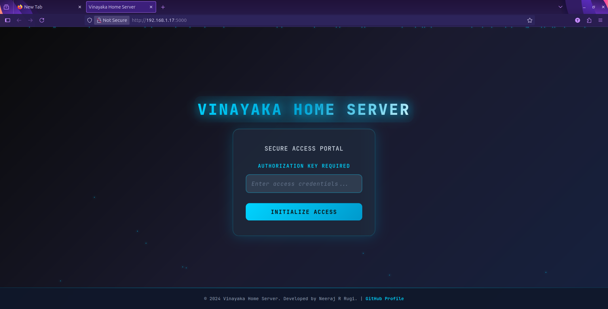
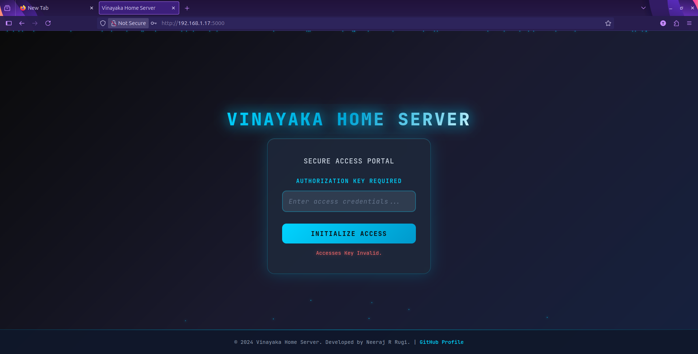
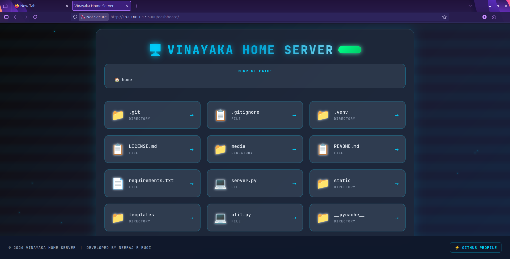
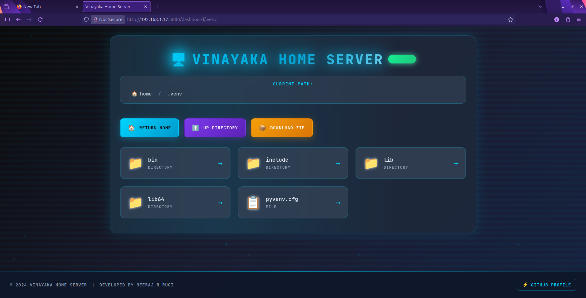

# Vinayaka Home Server

A simple Flask-based web server that provides secure access to files and directories on your local machine from any device connected to your home network. Perfect for students who want to access their files remotely within their local network.

## Table of Contents

- [⚠️ Important Security Disclaimer](#️-important-security-disclaimer)
- [Features](#features)
- [Prerequisites](#prerequisites)
- [Installation](#installation)
- [Quick Start](#quick-start)
  - [Basic Usage](#basic-usage)
  - [Secure Password Generation](#secure-password-generation)
  - [Command-Line Options](#command-line-options)
- [Creating a Standalone Executable](#creating-a-standalone-executable)
  - [Prerequisites for Executable](#prerequisites-for-executable)
  - [Build the Executable](#build-the-executable)
  - [Using the Executable](#using-the-executable)
  - [Adding to System PATH (Optional)](#adding-to-system-path-optional)
  - [Executable Benefits](#executable-benefits)
  - [Executable Limitations](#executable-limitations)
- [HTTPS and Browser Security Warnings](#https-and-browser-security-warnings)
  - [HTTPS Encryption](#https-encryption)
  - [Expected Browser Warnings](#expected-browser-warnings)
- [Configuration](#configuration)
  - [Method 1: Command-Line Arguments (Recommended)](#method-1-command-line-arguments-recommended)
  - [Method 2: Code Modification (Legacy)](#method-2-code-modification-legacy)
- [Usage](#usage)
  - [Starting the Server](#starting-the-server)
  - [Accessing from Other Devices](#accessing-from-other-devices)
  - [Navigation Features](#navigation-features)
- [Screenshots](#screenshots)
- [Security Features](#security-features)
  - [Enhanced Security Measures](#enhanced-security-measures)
  - [Built-in Security](#built-in-security)
  - [Security Best Practices](#security-best-practices)
- [Advanced Configuration](#advanced-configuration)
  - [Environment-Specific Examples](#environment-specific-examples)
  - [Multiple Configurations](#multiple-configurations)
- [Troubleshooting](#troubleshooting)
  - [Common Issues](#common-issues)
  - [Getting Help](#getting-help)
  - [Network Troubleshooting](#network-troubleshooting)
- [Development](#development)
  - [Project Structure](#project-structure)
  - [Key Components](#key-components)
  - [Security Implementation Details](#security-implementation-details)
  - [Adding Custom Features](#adding-custom-features)
- [License](#license)
- [Contributing](#contributing)

---

## ⚠️ Important Security Disclaimer

**READ THIS CAREFULLY BEFORE USING THIS SERVER**

This server is designed **ONLY** for use on safe, secured, and trusted networks such as:
- Your personal home WiFi network
- Your personal mobile hotspot
- Other networks you completely trust and control

**NEVER use this server on:**
- Public WiFi networks (coffee shops, airports, hotels, etc.)
- University or workplace networks
- Any network you don't personally control
- Networks with unknown or untrusted users

**Additional Safety Requirements:**
- **NEVER leave the server running unattended** - Always stop the server when you're not actively using it
- **NEVER expose this server to the internet** - This is for local network use only
- **NEVER use weak passwords** - Use a strong, unique password or generate one automatically
- **NEVER run this on a network with people you don't trust** - Anyone on the network can potentially access your files if they discover the server

**Why these restrictions matter:**
- This server provides direct access to your file system
- It uses basic authentication that may be vulnerable on untrusted networks
- Malicious users on the same network could potentially discover and exploit the server
- Running unattended increases the risk of unauthorized access

**Your responsibility:** You are solely responsible for ensuring this server is used safely and securely. The authors are not responsible for any data loss, security breaches, or other issues that may arise from improper use.

By using this server, you acknowledge that you understand these risks and will only use it in appropriate, secure environments.

## Features

- **Enhanced Security**: HTTPS encryption with self-signed certificates
- **Password Protection**: Secure login system with PBKDF2-SHA256 password hashing
- **Automatic Password Generation**: Generate cryptographically secure 32-character passwords
- **Directory Navigation**: Browse through folders and files with an intuitive web interface
- **File Serving**: Direct file access and download capabilities
- **ZIP Downloads**: Download entire folders as ZIP archives (with robust exclusion support)
- **Network Access**: Access your files from any device on your local network
- **Security Controls**: Path traversal protection and directory exclusion (now robust with subdirectory support)
- **Command-Line Configuration**: Easy setup with command-line arguments
- **Debug Mode**: Optional debug mode for development
- **Clean UI**: Modern, responsive design with JetBrains Mono font

## Prerequisites

- Python 3.6 or higher
- Flask web framework
- A local network (WiFi/Ethernet)

## Installation

1. **Clone or download the project files**
   ```bash
   git clone https://github.com/neeraj-r-rugi/Vinayaka-Home-Server
   cd vinayaka-home-server
   ```

2. **Install required dependencies**
   ```bash
   pip install flask
   ```

3. **Optional: Install PyInstaller for standalone executable**
   ```bash
   pip install pyinstaller
   ```

4. **Create the required directory structure**
   ```
   project-folder/
   ├── server.py
   ├── util.py
   ├── templates/
   │   ├── index.html
   │   └── dashboard.html
   └── static/
       ├── index_style.css
       └── dash_style.css
   ```

## Quick Start

### Basic Usage
The simplest way to start the server with default settings:

```bash
python server.py
```

This will:
- Use `./` as the default directory (Change this to your actual drive.)
- Set password to "Dingus" (change this for security!)
- Start the server on `https://0.0.0.0:5000` with HTTPS encryption

### Secure Password Generation
For maximum security, generate a cryptographically secure password:

```bash
python server.py --generate
```

This will:
- Generate a secure 32-character password using uppercase, lowercase, digits, and special characters
- Display the password in the terminal (save it somewhere safe!)
- Use PBKDF2-SHA256 hashing for password storage
- Override any password specified with `--password`

**Example output:**
```
Your Secure Passkey is: K7#mN9@pQ2$vX8&wE4*rT6%yU1!sA3^z
```

### Command-Line Options

The server supports several command-line arguments for easy configuration:

```bash
python server.py [OPTIONS]
```

#### Available Options:

| Option | Short | Description | Default |
|--------|--------|-------------|---------|
| `--data-dir` | `-dir` | Directory to serve files from | `./` |
| `--password` | `-ps` | Password for server access | `Dingus` |
| `--exclude-dir` | `-ed` | Directories (and subdirectories) to exclude (space-separated) | None |
| `--generate` | `-gen` | Generate a secure 32-character password (overrides --password) | Disabled |
| `--debug` | `-db` | Enable Flask debug mode | Disabled |
| `--help` | `-h` | Show help message | - |

#### Usage Examples:

**Generate a secure password:**
```bash
python server.py --generate --data-dir "/home/username/Documents"
```

**Basic configuration with custom directory and password:**
```bash
python server.py --data-dir "/home/username/Documents" --password "MySecurePassword123"
```

**Exclude specific directories or subdirectories:**
```bash
python server.py --data-dir "/home/user/files" --exclude-dir "Private" "Confidential" "Personal" "Media/Videos"
```
> **Note:** Exclusion is robust. You can specify subdirectories (e.g., `"Media/Videos"`), and both `"Folder"` and `"Folder/"` are treated the same.

**Enable debug mode for development:**
```bash
python server.py --debug --password "DevPassword"
```

**Full configuration example with generated password:**
```bash
python server.py \
    --data-dir "/Users/john/SharedFiles" \
    --generate \
    --exclude-dir "Private" "Work" "Confidential" "Projects/Old" \
    --debug
```

**Windows example:**
```cmd
python server.py --data-dir "C:\Users\YourName\Documents" --generate
```

## Creating a Standalone Executable

For easier distribution and usage without requiring Python installation on target machines, you can create a standalone executable using PyInstaller.

### **Prerequisites for Executable**
- PyInstaller installed: `pip install pyinstaller`
- All project files in the correct directory structure

### **Build the Executable**
Navigate to your project directory and run:

```bash
pyinstaller --onefile --console --add-data "templates:templates" --add-data "static:static" server.py
```

**Command breakdown:**
- `--onefile`: Creates a single executable file instead of a folder
- `--console`: Keeps the console window open to see server output and generated passwords
- `--add-data "templates:templates"`: Includes the HTML templates in the executable
- `--add-data "static:static"`: Includes CSS stylesheets in the executable
- `server.py`: The main Python file to convert

### **Using the Executable**

After building, you'll find the executable in the `dist/` folder:

**Linux/macOS:**
```bash
# Navigate to the dist folder
cd dist/

# Run with generated password
./server --generate --data-dir "/path/to/your/files"

# Or with custom password
./server --data-dir "/path/to/your/files" --password "YourPassword"

#Launch in the same context as the terminal(Deafults to ./)
./server --password "YourPassword"
```

**Windows:**
```cmd
# Navigate to the dist folder
cd dist\

# Run with generated password
server.exe --generate --data-dir "C:\Path\To\Your\Files"

# Or with custom password  
server.exe --data-dir "C:\Path\To\Your\Files" --password "YourPassword"

#Launch in the same context as the terminal(Deafults to ./)
server.exe --password "YourPassword"
```

### **Adding to System PATH (Optional)**

To run the executable from anywhere without specifying the full path:

**Linux/macOS:**
1. Copy the executable to a directory in your PATH:
   ```bash
   sudo cp dist/server /usr/local/bin/vinayaka-server
   sudo chmod +x /usr/local/bin/vinayaka-server
   ```

2. Now you can run from anywhere:
   ```bash
   vinayaka-server --generate --data-dir "/home/user/Documents"
   ```

**Windows:**
1. **Copy executable to a permanent location:**
   ```cmd
   mkdir "C:\Program Files\VinayakaServer"
   copy "dist\server.exe" "C:\Program Files\VinayakaServer\vinayaka-server.exe"
   ```

2. **Add to System PATH:**
   - Press `Win + R`, type `sysdm.cpl`, press Enter
   - Click "Environment Variables"
   - Under "System Variables", find and select "Path", click "Edit"
   - Click "New" and add: `C:\Program Files\VinayakaServer`
   - Click "OK" on all dialogs
   - Restart Command Prompt

3. **Now you can run from anywhere:**
   ```cmd
   vinayaka-server --generate --data-dir "C:\Users\YourName\Documents"
   ```

### **Executable Benefits**
- **No Python Required**: Run on machines without Python installed
- **Self-Contained**: All dependencies bundled into a single file
- **Easy Distribution**: Share a single executable file with others
- **Cross-Platform**: Build on Windows for Windows, Linux for Linux, etc.
- **Path Integration**: Add to system PATH for global access

### **Executable Limitations**
- **Platform Specific**: Must build on target platform (Windows exe won't run on Linux)
- **Larger File Size**: Includes Python interpreter and all dependencies
- **Slower Startup**: Takes longer to start than native Python execution
- **Antivirus Warnings**: Some antivirus software may flag PyInstaller executables

## HTTPS and Browser Security Warnings

### HTTPS Encryption
The server now uses **HTTPS encryption** by default with self-signed certificates (adhoc mode) for enhanced security. This means:
- All communication between your browser and the server is encrypted
- Your password and file transfers are protected from network eavesdropping
- The connection is more secure than plain HTTP

### Expected Browser Warnings
⚠️ **Important**: When you first access the server, your browser will show a security warning because the server uses a self-signed certificate. This is **normal and expected**.

**You will see warnings like:**
- "Your connection is not private"
- "Potential Security Risk Ahead"
- "This site's security certificate is not trusted"

**How to proceed safely:**
1. **Click "Advanced" or "Advanced Settings"**
2. **Click "Proceed to [your-ip]:5000 (unsafe)" or "Accept the Risk and Continue"**
3. **Some browsers may ask you to type "thisisunsafe"**

This warning appears because:
- The certificate is self-signed (not from a trusted Certificate Authority)
- This is normal for local development servers
- The encryption is still active and protecting your data
- You're connecting to your own server on your trusted network

**Browser-specific instructions:**
- **Chrome**: Click "Advanced" → "Proceed to [IP] (unsafe)"
- **Firefox**: Click "Advanced" → "Accept the Risk and Continue"
- **Safari**: Click "Advanced" → "Visit this website"
- **Edge**: Click "Advanced" → "Continue to [IP] (unsafe)"

## Configuration

### Method 1: Command-Line Arguments (Recommended)
Use the command-line options as shown above for quick and easy configuration.

### Method 2: Code Modification (Legacy)
You can also modify the default values directly in `util.py`:

```python
def init_parser() -> argparse.ArgumentParser:
    parser = argparse.ArgumentParser(prog="VinayakaHomeServer", description="A Local WAN Home Data Server")
    parser.add_argument("--data-dir", "-dir",
                        default="/your/custom/directory",  # Change this
                        help="The Directory which the server is to host.")
    parser.add_argument("--password", "-ps",
                        default="YourSecurePassword",      # Change this
                        help="The Password for Logging into your server.")
    # ... rest of the configuration
```

## Usage

### Starting the Server

1. **Navigate to the project directory**
   ```bash
   cd /path/to/vinayaka-home-server
   ```

2. **Run the server with your desired configuration**
   ```bash
   # Example: Generate secure password and set custom directory
   python server.py --generate --data-dir "/home/user/files"
   ```

3. **Server will start and display connection information**
   ```
   Your Secure Passkey is: K7#mN9@pQ2$vX8&wE4*rT6%yU1!sA3^z
   * Running on all addresses (0.0.0.0)
   * Running on https://127.0.0.1:5000
   * Running on https://[your-local-ip]:5000
   ```

   **📝 Important**: Save the generated password somewhere safe! You'll need it to log in.

### Accessing from Other Devices

1. **Find your computer's local IP address**
   - **Windows**: Open Command Prompt and run `ipconfig`
   - **macOS/Linux**: Open Terminal and run `ifconfig` or `ip addr show`

2. **Connect from any device on your network**
   - Open a web browser on any device connected to the same network
   - Navigate to: `https://[your-computer-ip]:5000` (note the **https**)
   - Example: `https://192.168.1.100:5000`

3. **Handle the security warning (expected)**
   - Click "Advanced" when you see the security warning
   - Click "Proceed" or "Accept the Risk and Continue"
   - This is normal for self-signed certificates

4. **Login with your password**
   - Enter the password you set with `--password` or the generated secure password
   - Click "Login" to access the file browser

### Navigation Features

- **Browse Directories**: Click on folder names (marked with `/`) to navigate into them
- **Download Files**: Click on file names to view or download them
- **Download Folders**: Use "📦 Download Folder as ZIP" to download entire directories (excluded directories and subdirectories will not be included)
- **Go Back**: Use "⬆️ Up One Directory" to go back to the parent directory
- **Return Home**: Click "🏠 Return Home" to go back to the base directory
- **Breadcrumb Navigation**: Use the path navigation at the top to jump to any parent directory

## Screenshots

Get a visual overview of the Vinayaka Home Server interface:

| Feature | Screenshot | Description |
|---------|------------|-------------|
| **Secure Login Interface** |  | Clean, modern login page with password authentication. Enter your configured password or generated secure passkey to access your files. |
| **Authentication Security** |  | Security feedback system that displays clear error messages for invalid login attempts, helping protect against unauthorized access. |
| **Main File Dashboard** |  | Intuitive file browser showing directories and files with easy navigation controls. Features breadcrumb navigation, directory/file icons, and quick action buttons for ZIP downloads and navigation. |
| **Directory Navigation** |  | Seamless browsing experience within subdirectories, maintaining the same clean interface with full path visibility and navigation controls. |

The interface is designed with a clean, responsive layout using JetBrains Mono font for excellent readability across all devices on your network.

## Security Features

### Enhanced Security Measures
- **HTTPS Encryption**: All traffic is encrypted using SSL/TLS with self-signed certificates
- **Password Hashing**: Passwords are hashed using PBKDF2-SHA256 algorithm
- **Secure Password Generation**: Cryptographically secure 32-character passwords
- **Session Management**: Secure session handling with randomly generated secret keys
- **Path Traversal Protection**: Prevents access to directories outside the base directory
- **Directory Exclusion**: Hide sensitive directories or subdirectories from the web interface and ZIP downloads using `--exclude-dir`
- **Input Validation**: Proper validation of file paths and user inputs

### Built-in Security
- **Password Authentication**: Session-based login system with configurable passwords
- **Cryptographic Security**: Uses Python's `secrets` module for secure random generation
- **Hash Protection**: Passwords are never stored in plain text

### Security Best Practices
1. **Use Generated Passwords**: Always use the `--generate` flag for maximum security
   ```bash
   python server.py --generate --data-dir "/your/directory"
   ```

2. **Or Use a Strong Custom Password**: If not using generated passwords, choose a strong one
   ```bash
   python server.py --password "YourStrongPassword123!"
   ```

3. **Exclude Sensitive Directories or Subdirectories**: Hide private folders from the web interface and ZIP downloads
   ```bash
   python server.py --generate --exclude-dir "Private" "Personal" "Confidential" "Media/Videos"
   ```

4. **Local Network Only**: This server is designed for local network use only
5. **Firewall Configuration**: Ensure your firewall is properly configured
6. **Regular Updates**: Keep Python and Flask updated to the latest versions
7. **Save Your Password**: When using `--generate`, save the displayed password securely

## Advanced Configuration

### Environment-Specific Examples

**Student Setup with Generated Password:**
```bash
python server.py \
    --data-dir "/home/student/Documents" \
    --generate \
    --exclude-dir "Private" "Personal"
```

**Developer Setup:**
```bash
python server.py \
    --data-dir "/home/dev/Projects" \
    --generate \
    --exclude-dir ".git" "node_modules" "venv" \
    --debug
```

**Media Server Setup:**
```bash
python server.py \
    --data-dir "/media/external/Movies" \
    --generate \
    --exclude-dir "Private" "Personal"
```

### Multiple Configurations
You can create shell scripts or batch files for different configurations:

**Linux/macOS (server-config.sh):**
```bash
#!/bin/bash
python server.py \
    --data-dir "/home/user/SharedFiles" \
    --generate \
    --exclude-dir "Private" "Work"
```

**Windows (server-config.bat):**
```batch
@echo off
python server.py ^
    --data-dir "C:\Users\%USERNAME%\Documents" ^
    --generate ^
    --exclude-dir "Private" "Work"
```

## Troubleshooting

### Common Issues

1. **Browser security warnings (Expected behavior)**
   - **This is normal** - click "Advanced" then "Proceed" or "Accept Risk"
   - The warning appears because of the self-signed certificate
   - Your connection is still encrypted and secure

2. **Cannot connect from other devices**
   - Verify both devices are on the same network
   - Check firewall settings on the host computer
   - Ensure the server is running and listening on `0.0.0.0`
   - Use `https://` not `http://` in the URL

3. **Lost generated password**
   - The password is only displayed once when generated
   - Restart the server with `--generate` to create a new password
   - Consider saving generated passwords in a secure password manager

4. **SSL/Certificate errors**
   - These are expected with self-signed certificates
   - Follow the browser-specific instructions above to proceed
   - Ensure you're using `https://` not `http://`

5. **Permission denied errors**
   - Ensure the user running the server has read permissions for the specified `--data-dir`
   - Check directory permissions: `ls -la /path/to/directory`

6. **Files not displaying**
   - Verify the `--data-dir` path is correct and exists
   - Check if directories are listed in `--exclude-dir`

7. **Login issues**
   - Verify the password matches exactly (case-sensitive)
   - If using generated passwords, ensure you copied it correctly
   - Clear browser cookies and try again

8. **Command-line argument errors**
   - Use `python server.py --help` to see all available options
   - Ensure paths with spaces are properly quoted
   - On Windows, use forward slashes or escaped backslashes in paths

### Getting Help
```bash
# Display all available options and their descriptions
python server.py --help

# Generate a secure password and see all options
python server.py --generate --help
```

### Network Troubleshooting
```bash
# Test if server is accessible locally (note: https)
curl -k https://localhost:5000

# Find your IP address
# Linux/macOS:
ip addr show | grep inet
# Windows:
ipconfig
```

## Development

### Project Structure
```
vinayaka-home-server/
├── server.py              # Main Flask application with HTTPS support
├── util.py                # Command-line argument parser and password generation
├── templates/
│   ├── index.html          # Login page template
│   └── dashboard.html      # File browser template
└── static/
    ├── index_style.css     # Login page styles
    └── dash_style.css      # Dashboard styles
```

### Key Components
- **Flask Routes**: Handle authentication and file serving with HTTPS
- **Argument Parser**: Command-line configuration management including password generation
- **Security Features**: Password hashing, secure random generation, HTTPS encryption
- **Template Engine**: Jinja2 templates for dynamic HTML generation
- **Session Management**: Secure login state management with encrypted sessions
- **File System Integration**: Safe directory traversal and file serving
- **ZIP Generation**: In-memory ZIP creation for folder downloads (with robust exclusion logic)

### Security Implementation Details
- **Password Hashing**: Uses `werkzeug.security.generate_password_hash` with PBKDF2-SHA256
- **Secure Random Generation**: Uses Python's `secrets` module for cryptographically secure passwords
- **HTTPS**: Flask's adhoc SSL context for automatic certificate generation
- **Session Security**: Cryptographically secure session keys

### Adding Custom Features
The modular design makes it easy to extend functionality:
- **File upload**: Add upload routes and forms
- **User management**: Implement multiple user accounts
- **File search**: Add search functionality across directories
- **Thumbnails**: Generate previews for images and documents
- **Custom certificates**: Replace adhoc SSL with proper certificates

## License

This project is provided under the GNU GPL V3.0 License.

## Contributing

This is a student project, but suggestions and improvements are welcome! Here's how you can contribute:

### **🐛 Report Issues**
- **Bug Reports**: [Create an issue](https://github.com/neeraj-r-rugi/Vinayaka-Home-Server/issues/new) with detailed steps to reproduce the problem
- **Security Vulnerabilities**: Use GitHub's private security advisory feature to report security issues responsibly

### **💡 Suggest Features**  
- **Feature Requests**: [Open a feature request](https://github.com/neeraj-r-rugi/Vinayaka-Home-Server/issues/new) for new command-line options or functionality
- **Discussions**: Join [GitHub Discussions](https://github.com/neeraj-r-rugi/Vinayaka-Home-Server/discussions) to discuss ideas with the community

### **🔧 Contribute Code**
- **Pull Requests**: Fork the repository and submit pull requests with your improvements
- **Documentation**: Help improve this README, code comments, or create additional guides
- **Examples**: Share useful configuration examples or use cases

### **📋 Guidelines**
- Search existing issues before creating new ones to avoid duplicates
- Provide clear, detailed descriptions for bug reports and feature requests  
- Follow the existing code style and structure when submitting pull requests
- Test your changes thoroughly before submitting

All contributions help make this project better for the student and developer community!

---

**Remember: Always prioritize security when using this server. Use generated passwords, only use it on trusted networks, and always proceed through browser security warnings for self-signed certificates!**